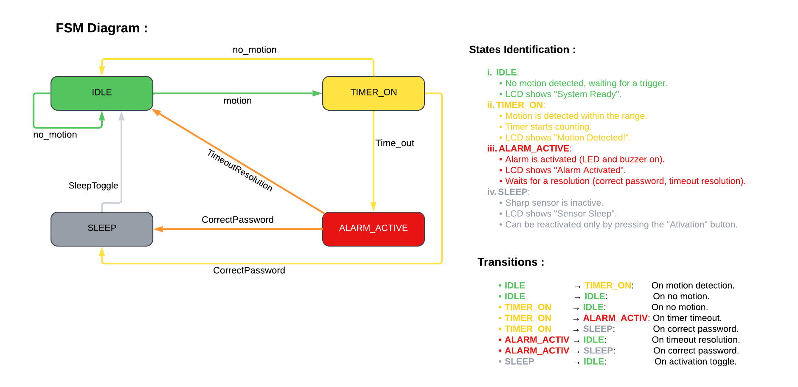

# 🔐 Motion Detection Security System

## 📜 Overview  
The **Motion Detection Security System** is an Arduino-based project designed to provide a robust and reliable security solution. It leverages a Sharp infrared sensor for motion detection, a 4x4 keypad for password authentication, and a Finite State Machine (FSM) to manage the system's behavior. The project is modular and scalable, making it suitable for real-world applications like home automation, and IoT security.

---

## 🎯 Features  

- **Motion Detection**: Utilizes the Sharp 2D120x infrared sensor to detect motion within a defined range.  
- **Password Protection**: A 4x4 keypad is used to enter and verify passwords, ensuring secure access to critical states like sleep mode.  
- **Finite State Machine (FSM)**: Clearly defined states (`IDLE`, `TIMER_ON`, `ALARM_ACTIV`, and `SLEEP`) for structured and predictable behavior.  
- **Alarm System**: Activates a red LED and buzzer after a defined timeout period when motion is detected but not resolved.  
- **Sleep Mode**: Disables motion detection and alarms, conserving energy until manually reactivated.  
- **Energy Efficiency**: The system supports toggling to sleep mode, which disables unnecessary hardware until required.  

---

## 🔧 Hardware Components  

### Required Components  
1. **Arduino Mega**  
2. **Sharp 2D120x Infrared Distance Sensor**  
3. **4x4 Keypad**  
4. **16x2 LCD**  
5. **Buzzer**  
6. **Red LED**  
7. **Push Button (Activation Toggle)**  

### Hardware Connections  
1. **Sharp Sensor**:  
   - Signal pin → `coming soon`  
   - VCC → `coming soon`  
   - GND → `coming soon`  

2. **4x4 Keypad**:  
   - Row pins → Digital pins `coming soon`  
   - Column pins → Digital pins `coming soon`  

3. **LCD with I2C**:  
   - SDA → `coming soon`  
   - SCL → `coming soon`  

4. **Buzzer and LED**:  
   - Buzzer pin → `coming soon`  
   - LED pin → `coming soon`  

5. **Activation Button**:  
   - One side → `coming soon`  
   - Other side → `coming soon`  

---

## ⚙️ System States  

The system is governed by a Finite State Machine with the following states:  

1. **IDLE**:  
   - The system scans for motion using the Sharp sensor.  
   - Transitions to `TIMER_ON` on motion detection or stays in `IDLE` if no motion is detected.  

2. **TIMER_ON**:  
   - A timer is activated when motion is detected.  
   - The system transitions to `ALARM_ACTIV` on timeout, to `SLEEP` if the correct password is entered, or back to `IDLE` if motion ceases.  

3. **ALARM_ACTIV**:  
   - The system activates a buzzer and LED.  
   - Transitions to `SLEEP` on correct password entry or to `IDLE` after the alarm auto-stops.  

4. **SLEEP**:  
   - The system disables motion detection and alarms.  
   - Transitions back to `IDLE` upon pressing the activation button.

## 📊 FSM Diagram




---

### 🚀 Real-World Applications  

This project can be applied to various domains, such as:  

1. **Home Security**: Detect motion and secure the premises with alarms and authentication.  
2. **IoT Devices**: Integrate with smart home systems for advanced automation.  
3. **Industrial Monitoring**: Use the system to monitor unauthorized access in factories or warehouses.  

---

### 📈 Future Improvements  

1. **WiFi Integration**: Add ESP32 capabilities to send notifications to a mobile app or email.  
2. **Battery Optimization**: Implement low-power modes for energy-efficient operation.  
3. **Camera Integration**: Add a camera module for capturing images upon motion detection.

---

## 🖥️ Software Implementation  

### Libraries Used  
1. `LiquidCrystal.h`: For interfacing with the LCD.  
2. `Keypad.h`: For handling input from the 4x4 keypad.  

### FSM Implementation  
The FSM is implemented using an `enum` to define the states, with transitions handled in a `switch-case` structure. Each state has its own function to manage behavior and transitions.

### Key Functions  

1. **Motion Detection**  
```cpp
void checkMotion() {
  int sharpValue = analogRead(SHARP_SENSOR_PIN);
  motionDetected = (sharpValue > 300 && sharpValue < 700); // Adjust range

  if (motionDetected) {
    currentState = TIMER_ON;
    timerStartTime = millis();
    lcd.clear();
    lcd.print("Motion Detected");
  }
}
```
2. **Password Verification**  
```cpp
void handleKeypadInput() {
  char key = keypad.getKey();
  if (key) {
    enteredPassword += key;
    lcd.setCursor(0, 1);
    lcd.print(enteredPassword);

    if (enteredPassword.length() == correctPassword.length()) {
      if (enteredPassword == correctPassword) {
        currentState = SLEEP;
        enterSleepMode();
      } else {
        lcd.print("Wrong Password");
        delay(2000);
        enteredPassword = "";
      }
    }
  }
}
```

3. **Sleep Mode Activation**
```cpp
void enterSleepMode() {
  lcd.clear();
  lcd.print("Entering Sleep");
  delay(2000);
  lcd.clear();
  lcd.print("System in Sleep");
}
```

4. **Activation Button Handling**
```cpp
void handleActivationButton() {
  if (digitalRead(ACTIVATION_BUTTON) == LOW) {
    lcd.clear();
    lcd.print("Reactivating...");
    delay(5000); // Simulate delay
    currentState = IDLE;
    lcd.clear();
    lcd.print("System Ready");
  }
}
```
